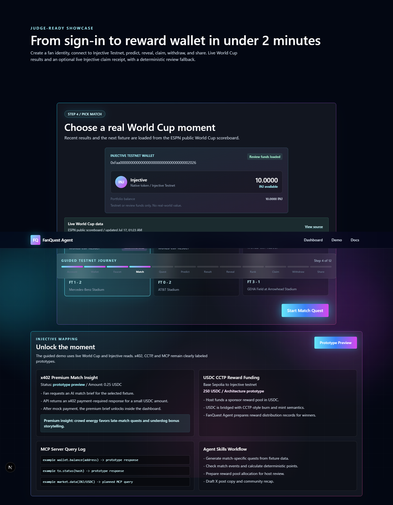
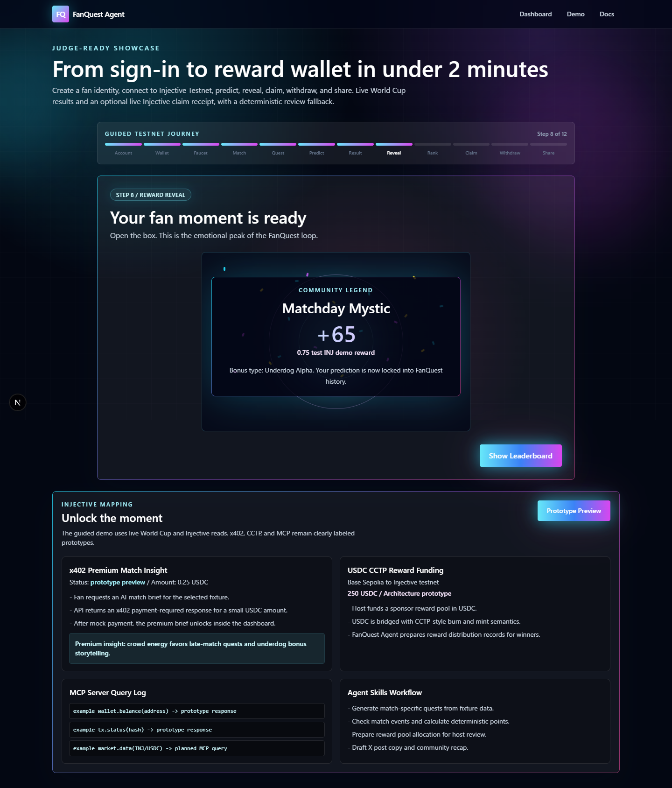
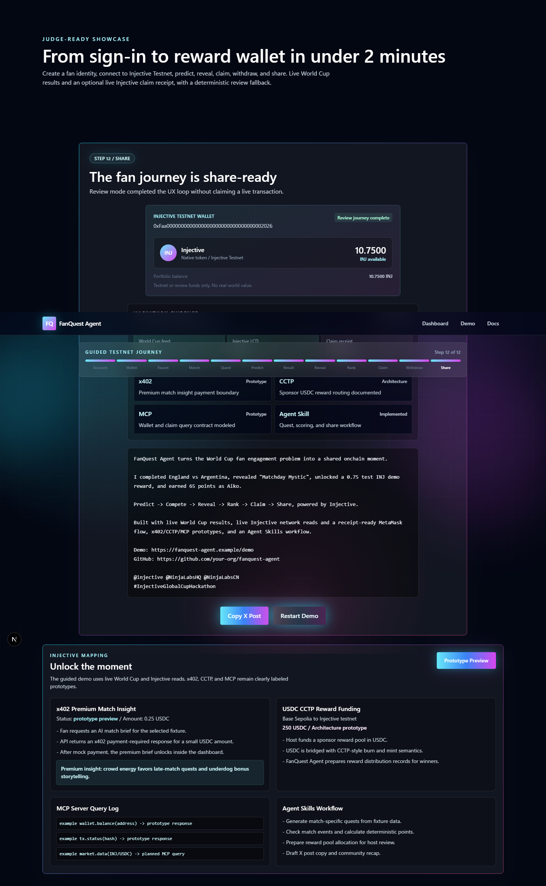
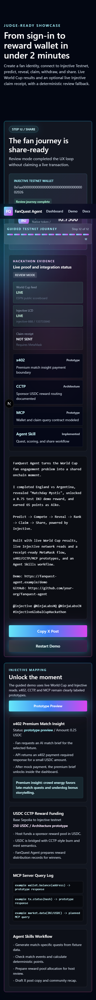

# FanQuest Agent

FanQuest Agent turns a World Cup match into a guided fan loop:

**Predict -> Compete -> Reveal -> Rank -> Claim -> Share**

It is a free-to-play fan engagement product for watch parties, Discord communities, and Web3 campaigns. Predictions produce points, badges, and demo sponsor rewards; they are not gambling or wagering.

## Judge Demo

Open `/demo` and complete the 12-step journey in under two minutes:

1. Create a deterministic Google demo identity.
2. Connect MetaMask to Injective EVM Testnet, or continue in clearly labeled Review mode.
3. Read the wallet's live INJ balance and open the official faucet when gas is needed.
4. Pick a recent World Cup result loaded from the ESPN public scoreboard.
5. Join the fan quest.
6. Lock winner, first-goal, player, and supporter predictions.
7. Replay the fetched final result and calculate points.
8. Open the reward box with confetti and glow.
9. See the current fan move onto the leaderboard.
10. Sign and submit a live Injective Testnet claim-receipt transaction when MetaMask is available.
11. Inspect the transaction hash, block, gas, and Blockscout link; review the payout boundary.
12. Generate and copy a share-ready X post.

## Demo Screenshots

Live match selection with source and update time:



The reward reveal is the emotional peak of the journey:



Review mode completes the story while clearly showing that no transaction was sent:



The full journey is responsive on a 390 px mobile viewport:



## What Is Live

| Capability | Status | Evidence |
| --- | --- | --- |
| World Cup match data | Live | `/api/worldcup/matches`, source, update time, scores, and explicit fallback reason |
| Injective native chain read | Live | `/api/injective/status` shows `injective-888` and latest block height |
| MetaMask wallet connection | Live | Injective EVM Testnet chain add/switch and user-controlled account access |
| INJ wallet balance | Live | `eth_getBalance` through the connected EIP-1193 wallet |
| Claim receipt | Live with MetaMask | User-signed zero-value transaction with FanQuest claim memo, receipt polling, and Blockscout link |
| Review journey | Deterministic | Complete no-extension fallback that never presents simulated activity as live |
| x402 | Prototype | Premium insight payment boundary and UI flow |
| USDC CCTP | Architecture prototype | Sponsor reward routing design |
| MCP Server | Prototype | Planned wallet, transaction, and market query contracts |
| Agent Skills | Implemented workflow | `docs/AGENT_SKILL.md` and quest/scoring/share automation |

## World Cup Data

`lib/worldcup-data.ts` reads the keyless ESPN FIFA World Cup scoreboard on the server. It requests a small rolling date window, normalizes events into `WorldCupMatch`, deduplicates matches, and prioritizes completed results for the judge demo.

The API response includes:

- `source`
- `sourceUrl`
- `fetchedAt`
- `live`
- `fallbackReason`
- normalized matches, status, score, venue, and winner

If the provider is unavailable or returns no usable event, the same endpoint returns six deterministic matches with `live: false`. The UI displays that fallback state and its reason.

Source endpoint: `https://site.api.espn.com/apis/site/v2/sports/soccer/fifa.world/scoreboard`

## Injective Testnet Claim Receipt

The browser integration is implemented in `lib/injective-evm.ts` without storing a private key.

- Network: Injective EVM Testnet
- Chain ID: `1439` (`0x59f`)
- RPC: `https://k8s.testnet.json-rpc.injective.network/`
- Explorer: `https://testnet.blockscout.injective.network`
- Faucet: `https://testnet.faucet.injective.network/`

The Claim step sends a user-signed, zero-value transaction from the connected address back to itself with a UTF-8 FanQuest claim memo in `data`. It is an actual testnet transaction and produces an Explorer-verifiable receipt. It does **not** transfer the displayed `0.75 INJ` reward.

The reward amount and Withdraw step remain deterministic demo accounting until a funded reward contract or treasury is deployed. The UI states this boundary explicitly.

## Review Mode

The in-app browser and some judge environments do not expose MetaMask. When no injected EIP-1193 wallet exists, `/demo` switches to Review mode and continues the full product journey. Review mode:

- uses a clearly labeled review address and balance;
- never generates a fake transaction hash;
- marks Claim as simulated;
- shows `NOT SENT / Requires MetaMask` in the final evidence panel;
- still demonstrates the complete UX without a dead end.

## Architecture

- `app/` - Next.js App Router pages and API routes
- `app/api/worldcup/matches/route.ts` - normalized live World Cup feed
- `app/api/injective/status/route.ts` - live Injective native-chain status
- `components/DemoScript.tsx` - guided 12-step judge journey
- `lib/worldcup-data.ts` - ESPN adapter and deterministic fallback
- `lib/injective-evm.ts` - MetaMask, balance, Claim transaction, and receipt logic
- `lib/quests.ts` - quest generation and deterministic scoring
- `lib/injective-plan.ts` - prototype status for x402, CCTP, MCP, and Agent Skills
- `docs/AGENT_SKILL.md` - agent workflow
- `docs/PRODUCT_REVIEW.md` - internal product review
- `docs/SUBMISSION_CHECKLIST.md` - July 19 submission gate

## Local Development

```bash
npm install
npm run dev
```

Open `http://127.0.0.1:3000/demo`.

On Windows PowerShell, use `npm.cmd` if the script execution policy blocks `npm`:

```powershell
npm.cmd install
npm.cmd run dev
```

## Environment Variables

No API key or private key is required.

| Variable | Required | Description |
| --- | --- | --- |
| `NEXT_PUBLIC_DEMO_URL` | For submission | Public `/demo` URL inserted into generated X copy |
| `NEXT_PUBLIC_GITHUB_URL` | For submission | Public repository URL inserted into generated X copy |

Use `.env.example` as the deployment template. Never put a wallet private key in this project.

## Verification

```bash
npm run lint
npm run build
```

Ephemeral proof utility:

```powershell
$env:FANQUEST_DRY_RUN="1"
npm.cmd run verify:testnet-claim
Remove-Item Env:FANQUEST_DRY_RUN
npm.cmd run verify:testnet-claim
```

The non-dry run prints a temporary public address and waits up to 15 minutes. Open the official faucet, paste the printed `inj...` address, and complete its captcha manually. The process keeps the ephemeral key only in memory, then sends the Claim memo and writes the public receipt to `docs/evidence/injective-testnet-claim.json`.

Manual verification:

1. Confirm `/api/worldcup/matches` returns `live: true` and recent completed matches.
2. Confirm `/api/injective/status` returns a live block height.
3. Complete all 12 steps in Review mode.
4. In a MetaMask-enabled browser, connect a funded Injective EVM Testnet account and submit one Claim receipt.
5. Open the returned Blockscout URL and capture the confirmed transaction for the submission video and README.

## Submission Status

The product journey, live World Cup feed, live Injective chain read, MetaMask integration, Claim transaction code, Explorer receipt UI, fallback behavior, and responsive core experience are implemented.

The remaining external submission gates are:

- set the real public demo and GitHub URLs;
- run one user-approved Claim transaction from a funded MetaMask testnet account;
- capture a confirmed Explorer receipt screenshot and a short demo video;
- deploy a funded reward contract only if actual `0.75 INJ` payout is required beyond the receipt proof.

See `docs/SUBMISSION_CHECKLIST.md` for the exact July 19 sequence.
